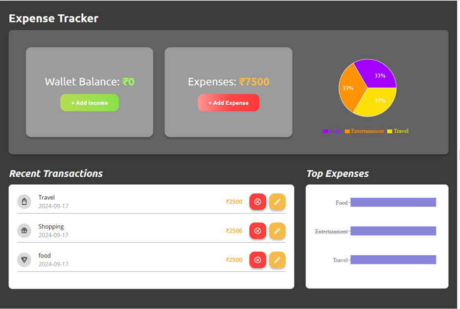

# Crio Code-A-Thon Project: Expense Tracker

## The App

A web application for tracking expenses, allowing users to add, edit, and delete expenses based on category and date, as well as view a summary of their expenses.

### Features:

- **Wallet Balance Management:**
  - The app starts with a default wallet balance of 5000.
  - Users can increase the wallet balance.
  - The app prevents users from spending more than their available wallet balance by showing an alert.
- **Expense Management:**
  - Users can add new expenses with details like title, amount, category, and date, with the wallet balance updating accordingly.
  - Users can edit existing expenses or delete them.
- **Expense Summary:**
  - The app provides a summary of total expenses, categorized by date or type.
- **Data Persistence:**
  - Both wallet balance and expenses are saved in `localStorage` to persist between page refreshes.
- **Responsive Design:**
  - The app is designed to work on various screen sizes, ensuring a seamless experience across devices.

## Tech Used

- `HTML`
- `CSS`
- `React JS`

## NPM Libraries Used for Charts 🚀

- `Recharts` for rendering the summary charts.
- `React-icons` for delete and edit expenses
- `React-modal` for State management library for React

# Getting Started with Create React App

This project was bootstrapped with [Create React App](https://github.com/facebook/create-react-app).

## Available Scripts

In the project directory, you can run:

### `npm start`

Runs the app in the development mode.  
Open [http://localhost:3000](http://localhost:3000) to view it in your browser.

The page will reload when you make changes.  
You may also see any lint errors in the console.

### `npm test`

Launches the test runner in the interactive watch mode.  
See the section about [running tests](https://facebook.github.io/create-react-app/docs/running-tests) for more information.

### `npm run build`

Builds the app for production to the `build` folder.  
It correctly bundles React in production mode and optimizes the build for the best performance.

The build is minified, and the filenames include the hashes.  
Your app is ready to be deployed!

See the section about [deployment](https://facebook.github.io/create-react-app/docs/deployment) for more information.

### `npm run eject`

**Note: this is a one-way operation. Once you `eject`, you can't go back!**

If you aren't satisfied with the build tool and configuration choices, you can `eject` at any time. This command will remove the single build dependency from your project.

Instead, it will copy all the configuration files and transitive dependencies (webpack, Babel, ESLint, etc.) right into your project so you have full control over them. All of the commands except `eject` will still work, but they will point to the copied scripts, allowing you to tweak them.

### Code Splitting

This section has moved here: [https://facebook.github.io/create-react-app/docs/code-splitting](https://facebook.github.io/create-react-app/docs/code-splitting)

### Analyzing the Bundle Size

This section has moved here: [https://facebook.github.io/create-react-app/docs/analyzing-the-bundle-size](https://facebook.github.io/create-react-app/docs/analyzing-the-bundle-size)

### Making a Progressive Web App

This section has moved here: [https://facebook.github.io/create-react-app/docs/making-a-progressive-web-app](https://facebook.github.io/create-react-app/docs/making-a-progressive-web-app)

### Advanced Configuration

This section has moved here: [https://facebook.github.io/create-react-app/docs/advanced-configuration](https://facebook.github.io/create-react-app/docs/advanced-configuration)

### Deployment

This section has moved here: [https://facebook.github.io/create-react-app/docs/deployment](https://facebook.github.io/create-react-app/docs/deployment)

### `npm run build` fails to minify

This section has moved here: [https://facebook.github.io/create-react-app/docs/troubleshooting#npm-run-build-fails-to-minify](https://facebook.github.io/create-react-app/docs/troubleshooting#npm-run-build-fails-to-minify)
